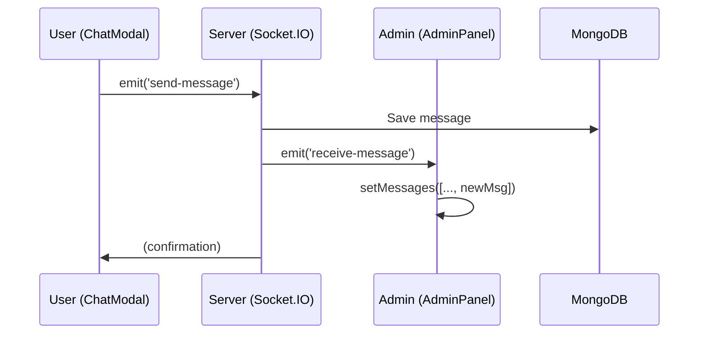
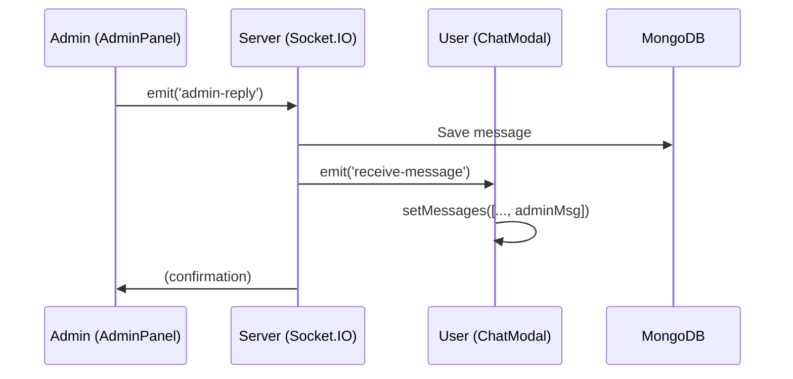

# 📱 Hướng dẫn: Admin Trả Lời Tin Nhắn User

## 🎯 Tóm Tắt

| Ai | Gửi tin | Nhận tin | Ở đâu |
|---|---|---|---|
| **USER** | Chat tab 2 | Nhận realtime | Modal user (ChatModal.js) |
| **ADMIN** | Dashboard | Nhận realtime + Drawer | AdminChatPanel.js |

---

## 1️⃣ USER NHẮN TIN (User Interface)

### 📍 Vị trí: `client/src/components/mainpages/chat/ChatModal.js`

**Bước 1:** User mở chat bubble → tab "Chat Admin"
```javascript
// Tab 2: Admin Chat Content
{
  key: '2',
  label: (
    <span>
      <PhoneOutlined /> Chat Admin
    </span>
  ),
  children: <AdminChatContent userId={userId} userName={userName} />,
}
```

**Bước 2:** User chọn admin từ danh sách
```javascript
// Admin Selection
<div className="admin-item" onClick={() =>
  setSelectedAdmin({
    _id: "admin_1",
    name: "Admin Hỗ Trợ",
  })
}>
```

**Bước 3:** User viết tin → gửi (Socket.IO)
```javascript
const handleSendMessage = () => {
  socket.emit("send-message", {
    user_id: userId,
    admin_id: selectedAdmin._id,
    message: message,  // Tin nhắn từ user
  });
};
```

✅ **Tin nhắn USER được lưu vào MongoDB + gửi qua Socket.IO realtime**

---

## 2️⃣ ADMIN NHẬN TIN & TRẢ LỜI

### 📍 Vị trí: `client/src/components/admin/AdminChatPanel.js`

### Cách 1: Admin Dashboard Component

**Import vào Admin Page:**
```javascript
// admin/dashboard.js (hoặc trang admin của bạn)
import AdminChatPanel from '../admin/AdminChatPanel';

export default function AdminDashboard() {
  return (
    <AdminChatPanel adminId="admin_123" />
  );
}
```

**Giao Diện Admin:**
```
┌─────────────────────────────────────┐
│  📞 ADMIN PANEL - Quản Lý Chat      │
├──────────────────┬──────────────────┤
│                  │                  │
│  Danh sách User  │  Chat với User   │
│                  │                  │
│  👤 User 1   ←→  │ Tin nhắn 1       │
│  👤 User 2      │ Tin nhắn 2       │
│  👤 User 3      │ Tin nhắn 3       │
│                  │                  │
│                  │ [Input] [Send]   │
└──────────────────┴──────────────────┘
```

### Admin Socket.IO Nhận Tin

**Socket Event:**
```javascript
newSocket.on('receive-message', (data) => {
  console.log('📩 New message from user:', data);
  
  // Thêm tin nhắn vào chat
  setMessages(prev => [...prev, {
    sender_type: data.sender_type,  // "user"
    sender_id: data.user_id,
    content: data.message,
    timestamp: new Date(data.timestamp)
  }]);
  
  // Cập nhật danh sách chat
  loadChatList();
});
```

### Admin Gửi Tin Trả Lời

```javascript
// AdminChatPanel.js - Line ~120
const handleSendMessage = () => {
  if (!inputMessage.trim() || !selectedChat || !socket) {
    return;
  }

  // ✅ Emit qua Socket.IO
  socket.emit('admin-reply', {
    user_id: selectedChat.user_id,
    admin_id: adminId,
    message: inputMessage  // Tin nhắn trả lời
  });

  // Hiển thị ngay trong chat
  setMessages(prev => [...prev, {
    sender_type: 'admin',
    sender_id: adminId,
    content: inputMessage,
    timestamp: new Date()
  }]);

  setInputMessage('');  // Xóa input
};
```

---

## 3️⃣ LUỒNG DỮ LIỆU (Data Flow)

### User Gửi → Admin Nhận

```
┌──────────────────────────────────────────────────────┐
│ USER                                                 │
│ ChatModal.js - AdminChatContent                     │
│ ┌──────────────────────────────────┐                │
│ │ input: "Xin chào admin"           │                │
│ │ [Send] button                    │                │
│ └──────────────────────────────────┘                │
│         ↓ socket.emit('send-message')               │
└──────────────────────────────────────────────────────┘
                    ↓ Socket.IO
┌──────────────────────────────────────────────────────┐
│ SERVER - server.js                                   │
│ socket.on('send-message', (data) => {               │
│   // Lưu vào MongoDB                                 │
│   // Broadcast tới admin                             │
│   socket.emit('receive-message', ...)               │
│ })                                                   │
└──────────────────────────────────────────────────────┘
                    ↓ Socket.IO
┌──────────────────────────────────────────────────────┐
│ ADMIN                                                │
│ AdminChatPanel.js                                   │
│ socket.on('receive-message', (data) => {            │
│   setMessages([...messages, data])                  │
│   // Tin nhắn hiển thị trong chat                    │
│ })                                                   │
└──────────────────────────────────────────────────────┘
```

### Admin Gửi → User Nhận

```
┌──────────────────────────────────────────────────────┐
│ ADMIN                                                │
│ AdminChatPanel.js                                   │
│ ┌──────────────────────────────────┐                │
│ │ input: "Chúng tôi sẽ hỗ trợ ngay" │                │
│ │ [Send] button                    │                │
│ └──────────────────────────────────┘                │
│         ↓ socket.emit('admin-reply')                │
└──────────────────────────────────────────────────────┘
                    ↓ Socket.IO
┌──────────────────────────────────────────────────────┐
│ SERVER - server.js                                   │
│ socket.on('admin-reply', (data) => {                │
│   // Lưu vào MongoDB                                 │
│   // Broadcast tới user                              │
│   socket.emit('receive-message', ...)               │
│ })                                                   │
└──────────────────────────────────────────────────────┘
                    ↓ Socket.IO
┌──────────────────────────────────────────────────────┐
│ USER                                                 │
│ ChatModal.js - AdminChatContent                     │
│ socket.on('receive-message', (data) => {            │
│   setMessages([...messages, data])                  │
│   // Tin nhắn hiển thị trong chat                    │
│ })                                                   │
└──────────────────────────────────────────────────────┘
```

---

## 4️⃣ SOCKET.IO EVENTS

### Backend Events (server.js)

```javascript
// User gửi tin
socket.on('send-message', (data) => {
  // data: { user_id, admin_id, message }
  
  // Lưu DB
  // Broadcast event
  io.emit('receive-message', {
    sender_type: 'user',
    user_id: data.user_id,
    admin_id: data.admin_id,
    message: data.message,
    timestamp: new Date()
  });
});

// Admin trả lời
socket.on('admin-reply', (data) => {
  // data: { user_id, admin_id, message }
  
  // Lưu DB
  // Broadcast event
  io.emit('receive-message', {
    sender_type: 'admin',
    admin_id: data.admin_id,
    user_id: data.user_id,
    message: data.message,
    timestamp: new Date()
  });
});
```

---

## 5️⃣ SETUP: Tích Hợp Admin Panel Vào Admin Dashboard

### Bước 1: Tìm trang admin của bạn
```bash
# Kiểm tra cấu trúc
ls client/src/components/mainpages/profile/
# hoặc
ls client/src/components/admin/
```

### Bước 2: Import AdminChatPanel
```javascript
// client/src/components/admin/AdminDashboard.js
import AdminChatPanel from './AdminChatPanel';

export default function AdminDashboard() {
  const admin_id = "admin_123"; // Lấy từ auth/user context
  
  return (
    <div className="admin-dashboard">
      <h1>Admin Panel</h1>
      <AdminChatPanel adminId={admin_id} />
    </div>
  );
}
```

### Bước 3: Thêm route
```javascript
// client/src/App.js
<Route path="/admin/chat" element={<AdminDashboard />} />
```

### Bước 4: Thêm navigation button
```javascript
// Header.js hoặc Menu
<a href="/admin/chat">💬 Admin Chat</a>
```

---

## 6️⃣ CÁCH HOẠT ĐỘNG CHI TIẾT

### Scenario 1: User Nhắn Tin Mới



### Scenario 2: Admin Trả Lời



---

## 7️⃣ CODE LOCATIONS

| Tính năng | File | Line |
|---|---|---|
| User gửi tin | `ChatModal.js` | ~323 |
| User nhận tin | `ChatModal.js` | ~278 |
| Admin gửi tin | `AdminChatPanel.js` | ~121 |
| Admin nhận tin | `AdminChatPanel.js` | ~48 |
| Server handle send | `server.js` | TBD |
| Server handle reply | `server.js` | TBD |
| Model lưu tin | `models/adminChatModel.js` | - |

---

## 8️⃣ TROUBLESHOOTING

| Vấn đề | Nguyên nhân | Giải pháp |
|---|---|---|
| Admin không nhận tin | Socket.IO không kết nối | Check CORS, check console |
| Tin nhắn không lưu DB | Model lỗi hoặc không save | Check adminChatModel.js |
| User không nhận tin admin | Socket broadcast lỗi | Check server.js emit events |
| 2 user cùng admin | Cần filter by chat ID | Dùng room Socket.IO |

---

## 9️⃣ NEXT STEPS

- [ ] Tích hợp AdminChatPanel vào trang admin
- [ ] Kiểm tra Socket.IO realtime hoạt động
- [ ] Thêm notification khi có tin nhắn mới
- [ ] Thêm read receipts (✓ vs ✓✓)
- [ ] Thêm typing indicators
- [ ] Hỗ trợ file upload (ảnh, tài liệu)

---

## 🔗 Tài liệu Liên Quan

- `CHAT_INTEGRATION_SUMMARY.md` - Tổng quan kiến trúc
- `CHAT_ADMIN_GUIDE.md` - Hướng dẫn chi tiết
- `server.js` - Backend Socket.IO code
